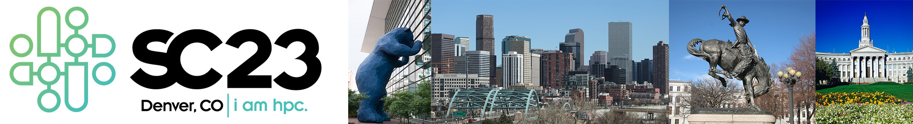

<h2>Correctness 2023: Seventh International Workshop on Software Correctness for HPC Applications</h2>

<h4> November 12, 2023 (half day, 1:30pm - 5pm MST) </h4>

<h4> Colorado Convention Center </h4>

<h4> Denver, Colorado, USA </h4>

<h5> Held in conjunction with SC23: <a href="https://sc23.supercomputing.org/">The International Conference for High Performance Computing, Networking, Storage and Analysis</a> </h5>

In cooperation with  

<!--

-->

----

Ensuring correctness in high-performance computing (HPC) applications is one of the fundamental challenges that the HPC community faces today. While significant advances in verification, testing, and debugging have been made to isolate software errors (or defects) in the context of non-HPC software, several factors make achieving correctness in HPC applications and systems much more challenging than in general systems software—growing heterogeneity (architectures with CPUs, GPUs, and special purpose accelerators), massive scale computations (very high degree of concurrency), use of combined parallel programing models (e.g., MPI+X), new scalable numerical algorithms (e.g., to leverage reduced precision in floating-point arithmetic), and aggressive compiler optimizations/transformations are some of the challenges that make correctness harder in HPC. The following report lays out the key challenges and research areas of HPC correctness: [DOE Report of the HPC Correctness Summit](https://www.osti.gov/biblio/1470989).

As the complexity of future architectures, algorithms, and applications in HPC increases, the ability to fully exploit exascale systems will be limited without correctness. With the continuous use of HPC software to advance scientific and technological capabilities, novel techniques and practical tools for software correctness in HPC are invaluable.

The goal of the Correctness Workshop is to bring together researchers and developers to present and discuss novel ideas to address the problem of correctness in HPC. The workshop will feature contributed papers and invited talks in this area.

----
### <a class="anchor" name="topics">Workshop Topics</a>

Topics of interest include, but are not limited to:

#### Correctness in Scientific Applications and Algorithms
* Formal methods and rigorous mathematical techniques for correctness in HPC applications
* Frameworks to address the challenges of testing complex HPC applications (e.g., multiphysics applications)
* Approaches for the specification of numerical algorithms with the goal of correctness checking
* Error identification in the design and implementation of numerical algorithms using finite-precision floating point numbers

#### Tools for Debugging, Testing, and Correctness Checking
* Program synthesis techniques for testing and debugging HPC applications
* Tools to control the effect of non-determinism when debugging and testing HPC software
* Scalable debugging solutions for large-scale HPC applications
* Scalable tools for model checking, verification, certification, or symbolic execution
* Static and dynamic analysis to test and check correctness in the entire HPC software ecosystem
* Predictive debugging and testing approaches to forecast the occurrence of errors in specific conditions
* Machine learning and anomaly detection for bug detection and localization

#### Programing Models and Runtime Systems Correctness
* Correctness in emerging HPC programing models
* Analysis of software error propagation and error handling in HPC runtime systems and libraries
* Metrics to measure the degree of correctness of HPC software
* Specifications to check the correctness of runtime systems

#### Other Areas
* Large databases of bug reports and/or reproducible test cases of HPC software
* Benchmarks to test the effectiveness of HPC correctness tools

----
### <a class="anchor" name="submissions"> Submissions and Format </a>

Authors are invited to submit manuscripts in English structured as technical or experience papers at a length of at least **6 pages** but not exceeding **8 pages** of content (2-column), including everything except references. Submissions must use the **ACM proceedings** template: [https://www.acm.org/publications/proceedings-template](https://www.acm.org/publications/proceedings-template). Latex users, please use the “sigconf” option.

<!--Submitted papers will be peer-reviewed by the Program Committee and accepted papers will be published by IEEE Xplore via TCHPC.-->
Submitted papers will be peer-reviewed by the Program Committee and accepted papers will be published by IEEE Xplore.

Submitted papers must represent original unpublished research that is not currently under review for any other venue. Papers not following these guidelines will be rejected without review. Submissions received after the due date, exceeding length limit, or not appropriately structured may also not be considered. At least one author of an accepted paper must register for and attend the workshop. Authors may contact the workshop organizers for more information. Papers should be submitted electronically at: [https://submissions.supercomputing.org/](https://submissions.supercomputing.org/).

#### SC Reproducibility Initiative

We encourage authors to submit an **optional** artifact description (AD) appendix along with their paper, describing the details of their software environments and computational experiments to the extent that an independent person could replicate their results. The AD appendix is not included in the 8-page limit of the paper and should not exceed **2 pages** of content. For more details of the **SC Reproducibility Initiative** please see: [https://sc23.supercomputing.org/program/papers/reproducibility-initiative/](https://sc23.supercomputing.org/program/papers/reproducibility-initiative/).

----
###  <a class="anchor" name="submissions"> HPC Bug Fest </a>
This year, we have the [HPC Bug Fest](https://sites.google.com/view/hpc-bugs-fest/home), a session that will focus on correctness benchmarks. The goal is to provide a detailed snapshot of the state-of-the-art HPC verification tools by both discussing their methodologies and comparing their evaluation metrics. 

This session only accepts short papers (2 to 4 pages) based on four different contributions: (1) 
codes to expand existing benchmarks, (2) new metrics to evaluate verification tools, (3) new results to track tools updates, and (4) 
real world cases of error correction. An artefact description is 
mandatory to ensure reproducibility. 

More information on the website: [https://sites.google.com/view/hpc-bugs-fest/home](https://sites.google.com/view/hpc-bugs-fest/home)

---
###  <a class="anchor" name="proceedings"> Proceedings </a>

The proceedings will be archived by ACM.

---
### <a class="anchor" name="dates"> Important Dates </a>

<!--
* Paper submissions due: ~~August 5, 2022~~ **Extended:** August 12, 2022 (submission updates will be allowed until August 14)
* Notification of acceptance: September 9, 2022
* E-copyright registration completed by authors: September 23, 2022
* Camera-ready papers due: September 30, 2022
-->
* Paper submissions due: ~~August 4, 2023~~ **Extended:** August 10, 2023
* Notification of acceptance: September 8, 2023
* E-copyright registration completed by authors: September 22, 2023
* Camera-ready papers due: September 22, 2023

All time zones are AOE.

---
### <a class="anchor" name="date">Workshop Date</a>

- Half-day Workshop
- November 12, 2023, 1:30pm - 5pm MST

---
### <a class="anchor" name="org">Organizers</a>

[Ignacio Laguna](http://lagunaresearch.org/), LLNL  
[Cindy Rubio-González](http://web.cs.ucdavis.edu/~rubio/), UC Davis

---
### <a class="anchor" name="pc">Program Committee</a>

[Alper Altuntas](https://staff.ucar.edu/users/altuntas), National Center for Atmospheric Research, USA  
[David Bailey](https://cs.ucdavis.edu/directory/david-bailey), LBNL & University of California, Davis, USA  
[Allison H. Baker](https://staff.ucar.edu/users/abaker), National Center for Atmospheric Research, USA  
[John Baugh](https://www.ccee.ncsu.edu/people/jwb/), North Carolina State University, USA  
[Patrick Carribault](http://www.cea.fr/), CEA-DAM, France   
[Ganesh Gopalakrishnan](https://www.cs.utah.edu/~ganesh/), University of Utah, USA  
[Jan Hueckelheim](https://www.anl.gov/profile/jan-huckelheim), Argonne National Laboratory, USA  
[Joachim Jenke](https://www.itc.rwth-aachen.de/cms/IT-Center/IT-Center/Team/~oobd/Joachim-Protze/lidx/1/), RWTH Aachen University, Germany  
[Michael O. Lam](https://w3.cs.jmu.edu/lam2mo/), James Madison University, USA  
[Jackson Mayo](http://www.sandia.gov/), Sandia National Laboratories, USA  
[Shyamali Mukherjee](https://dl.acm.org/profile/99659214722), Sandia National Laboratories, USA  
[Samuel	Pollard](https://scholar.google.com/citations?user=X0zJ484AAAAJ&hl=en), Sandia National Laboratories, USA  
[Emmanuelle Saillard](http://emmanuellesaillard.fr/), INRIA Bordeaux, France   
[Matt Sottile](https://scholar.google.com/citations?user=q6Z0FZMAAAAJ&hl=en), Lawrence Livermore National Laboratory, USA  
[Tristan Vanderbruggen](https://people.llnl.gov/vanderbrugge1), Lawrence Livermore National Laboratory, USA  

---
### <a class="anchor" name="venue">Venue</a>

- Colorado Convention Center, Denver, Colorado, USA
- Room: 708

---
### <a class="anchor" name="program">Program</a>
 

#### Workshop Introduction
<table>
<tr><td width="15">  </td> <td>2:00pm - 2:10pm:  <b>Opening Remarks</b>, Ignacio Laguna, Cindy Rubio-González </td> </tr>
<tr><td width="15">  </td> <td>2:10pm - 2:20pm:  <b>HPC Bugs Fest Introduction</b>, Emmanuelle Saillard </td> </tr>
</table>

#### Data Races (Chair: Jan Hückelheim)
<table>
<tr><td width="15">  </td> <td>2:20pm - 2:40pm:  Paper 1:  <b>"Mapping High-Level Concurrency from OpenMP and MPI to ThreadSanitizer Fibers"</b>, Joachim Jenke, Simon Schwitanski, Isabel Thärigen, Matthias S. Müller </td> </tr>

<tr><td width="15">  </td> <td>2:40pm - 3:00pm:  Paper 2: <b>"Data Race Detection Using Large Language Models"</b>, Le Chen, Xianzhong Ding, Murali Emani, Tristan Vanderbruggen, Pei-Hung Lin, Chunhua Liao </td> </tr>
</table>

#### Break
<table>
<tr><td width="15">  </td> <td> 3:00pm - 3:30pm:  Break </td> </tr>
</table>

#### Remote Memory Access (Chair: Mike Lam)
<table>
<tr><td width="15">  </td> <td>3:30pm - 3:50pm:  Paper 3: <b>"Rethinking Data Race Detection in MPI-RMA Programs"</b>, Radjasouria Vinayagame, Emmanuelle Saillard, Samuel Thibault, Van Man Nguyen, Marc Sergent </td> </tr>

<tr><td width="15">  </td> <td>3:50pm - 4:10pm:  Paper 4: <b>"RMARaceBench: A Microbenchmark Suite to Evaluate Race Detection Tools for RMA Programs"</b>, Simon Schwitanski, Joachim Jenke, Sven Klotz, Matthias S. Müller </td> </tr>
</table>
  
#### Mixed-Precision (Chair: Mike Lam)
<table>
<tr><td width="15">  </td> <td>4:10pm - 4:30pm:  Paper 5: <b>"Mixed-Precision S/DGEMM Using the TF32 and TF64 Frameworks on Low-Precision AI Tensor Cores"</b>, Pedro Valero-Lara, Ian Jorquera, Frank Lui, Jeffrey Vetter </td> </tr>
</table>

#### HPC Bugs Fest - Short Papers (Chair: Emmanuelle Saillard)
<table>
<tr><td width="15">  </td> <td>4:30pm - 4:42pm:  Paper 1: <b>"Towards Correctness Checking of MPI Partitioned Communication in MUST"</b>,
       Simon Schwitanski, Niko Sakic, Joachim Jenke, Felix Tomski, Marc-André Hermanns</td> </tr>

<tr><td width="15">  </td> <td>4:42pm - 4:54pm:  Paper 2: <b>"Adding Microbenchmarks with SIMD Data Race to DataRaceBench"</b>,
      Joachim Jenke, Kaloyan Ignatov, Simon Schwitanski</td> </tr>

<tr><td width="15">  </td> <td>4:54pm - 5:06pm:  Paper 3: <b>"Investigating the Real-World Applicability of MPI Correctness Benchmarks"</b>,
      Alexander Hück, Tim Jammer, Joachim Jenke, Christian Bischof</td> </tr>

<tr><td width="15">  </td> <td>5:06pm - 5:18pm:  Paper 4: <b>"Improve and stabilize classification results of DataRaceBench"</b>,
      Joachim Jenke, Simon Schwitanski</td> </tr>

<tr><td width="15">  </td> <td>5:18pm - 5:30pm:  Paper 5: <b>"Highlighting PARCOACH Improvements on MBI"</b>,
      Philippe Virouleau, Emmanuelle Saillard, Marc Sergent, Pierre Lemarinier</td> </tr>
</table>

---
###  <a class="anchor" name="contact">Contact Information</a>
Please address workshop questions to Ignacio Laguna (ilaguna@llnl.gov) and/or Cindy Rubio-González (crubio@ucdavis.edu).

---
### <a class="anchor" name="previous">Previous Workshops</a>
- [Correctness 2022](https://correctness-workshop.github.io/2022/)
- [Correctness 2021](https://correctness-workshop.github.io/2021/)
- [Correctness 2020](https://correctness-workshop.github.io/2020/)
- [Correctness 2019](https://correctness-workshop.github.io/2019/)
- [Correctness 2018](https://correctness-workshop.github.io/2018/)
- [Correctness 2017](https://correctness-workshop.github.io/2017/)

